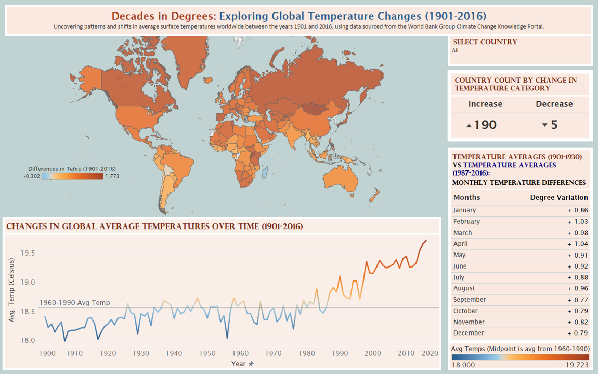

# Spatial and Temporal Dashboard

A static visualization examining average surface temperatures across world regions between 1901 and 2016.

## Purpose

I created this dashboard to compare regional 30-year temperature averages across time and to show how a spatial overview, time series, and monthly comparison complement one another.

## Data and time periods

The analysis uses climate data from the [World Bank Group Climate Change Knowledge Portal](https://climateknowledgeportal.worldbank.org/), spanning **1901–2016** and emphasizing comparable 30-year averages, including a **1960–1990 reference period**. The repository includes the final image and a concise narrative, not the source tables or build environment.

## Workflow and visualization sequence

1. Prepare regional temperature observations.
2. Compute comparable 30-year averages and retain the reference period.
3. Build a choropleth for geographic comparison.
4. Build a time series for change across available periods.
5. Build a monthly temperature-difference table.
6. Compose the views into one static export.

*Static dashboard comparing regional temperature patterns, time series, and monthly differences.*

## Interpretation and limitations

The dashboard supports descriptive comparison of regional averages and monthly differences. Country- or region-level aggregation can conceal local variation and missingness; the static export does not preserve interactive inspection. It is not a forecast or attribution analysis.

## Reproducibility

Obtain the portal data under current terms, record the download date and transformations, compute the comparable averages, and rebuild the three views. Exact values and formatting cannot be regenerated from the available outputs alone.

## Repository contents

- `spatial-and-temporal-dashboard.png`
- `project-notes.md`
- `README.md`
